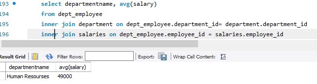

## SQL Project Employee database analysis

## Project Objective
this project aims to analyze employee data to gain insights into workforce demographics, perfromance, and compensation . The analysis covers various aspect such as total number employee, average salary of both genders,highest and lowest tenure of employee.

## Introduction
The employee Analysis project utilises the SQL to perform data analysis on an employee database. The project aim helps in understanding the structure and performance of an organisation through data insights.

##  Queries done
1) ** total number of employee**

    

2) ** avg salary of the human resources department**
   
